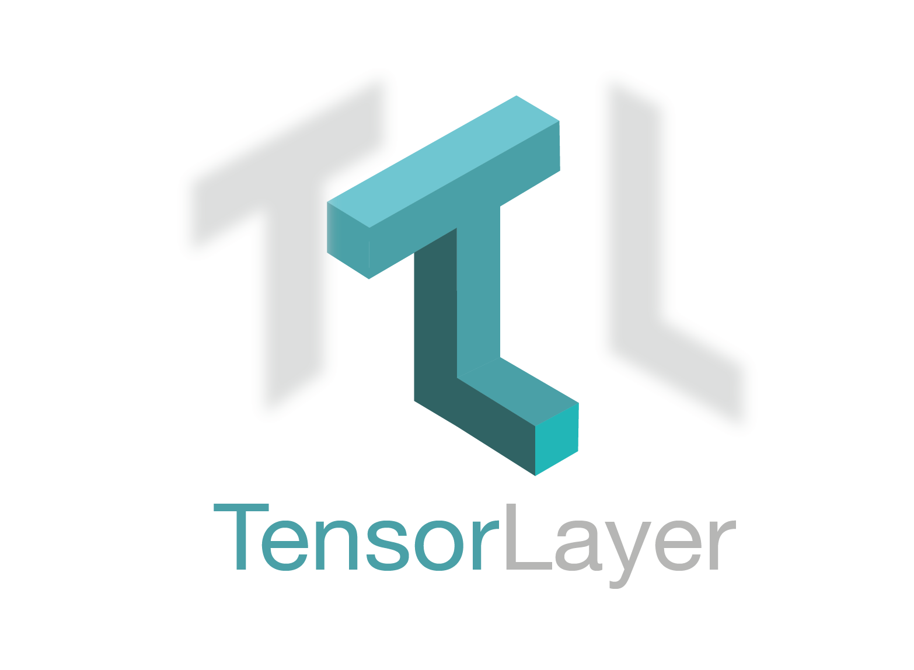

Welcome to TensorLayer
=======================================

**Good News:** We won the **Best Open Source Software Award** `@ACM Multimedia (MM) 2017 <http://www.acmmm.org/2017/mm-2017-awardees/>`_.

`TensorLayer`_ is a Deep Learning (DL) and Reinforcement Learning (RL) library extended from `Google TensorFlow <https://www.tensorflow.org>`_.  It provides popular DL and RL modules that can be easily customized and assembled for tackling real-world machine learning problems.
More details can be found `here <https://github.com/zsdonghao/tensorlayer>`_.

.. note::
   If you got problem to read the docs online, you could download the repository
   on `GitHub`_, then go to ``/docs/_build/html/index.html`` to read the docs
   offline. The ``_build`` folder can be generated in ``docs`` using ``make html``.

User Guide
------------

The TensorLayer user guide explains how to install TensorFlow, CUDA and cuDNN,
how to build and train neural networks using TensorLayer, and how to contribute
to the library as a developer.

.. toctree::
  :maxdepth: 2

  user/installation
  user/tutorial
  user/example
  user/development
  user/more

API Reference
-------------

If you are looking for information on a specific function, class or
method, this part of the documentation is for you.

.. toctree::
  :maxdepth: 2

  modules/layers
  modules/cost
  modules/prepro
  modules/iterate
  modules/utils
  modules/nlp
  modules/rein
  modules/files
  modules/visualize
  modules/ops
  modules/activation
  modules/distributed
  modules/db

Indices and tables
==================

* :ref:`genindex`
* :ref:`modindex`
* :ref:`search`

.. _GitHub: https://github.com/zsdonghao/tensorlayer
.. _TensorLayer: https://github.com/zsdonghao/tensorlayer/
