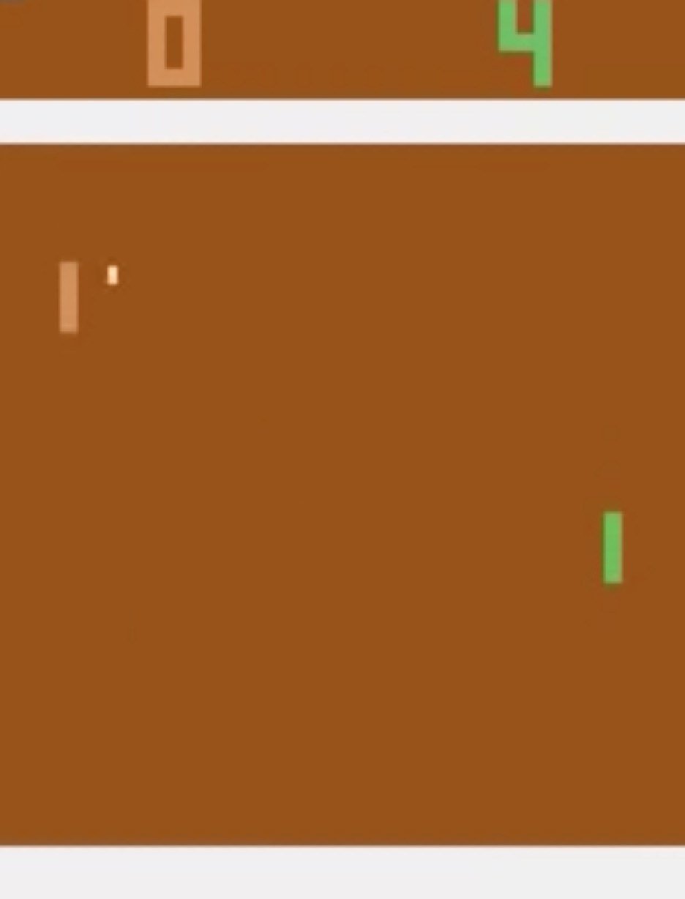
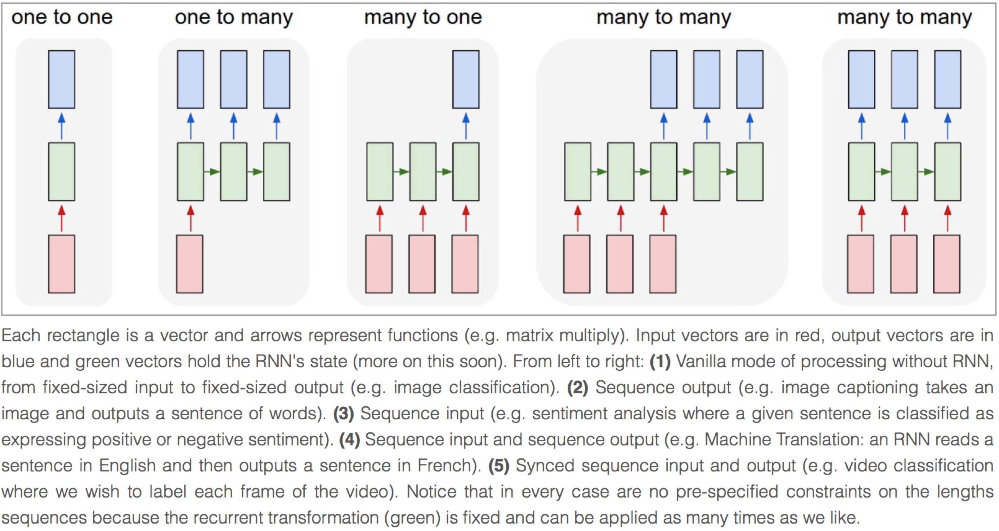

.. _tutorial:

========
Tutorial
========

For deep learning, this tutorial will walk you through building a handwritten
digits classifier using the MNIST dataset, arguably the "Hello World" of neural
networks. For reinforcement learning, we will let computer learns to play Pong
game from the original screen inputs. For nature language processing, we start
from word embedding, and then describe language modeling and machine
translation.

.. note::
    For experts: Read the source code of ``InputLayer`` and ``DenseLayer``, you
    will understand how `TuneLayer`_ work. After that, we recommend you to read
    the codes for tutorial directly.

Before we start
===============

The tutorial assumes that you are somewhat familiar with neural networks and
TensorFlow (the library which `TuneLayer`_ is built on top of). You can try to learn
both at once from the `Deeplearning Tutorial`_.

For a more slow-paced introduction to artificial neural networks, we recommend
`Convolutional Neural Networks for Visual Recognition`_ by Andrej Karpathy et
al., `Neural Networks and Deep Learning`_ by Michael Nielsen.

To learn more about TensorFlow, have a look at the `TensorFlow tutorial`_. You will not
need all of it, but a basic understanding of how TensorFlow works is required to be
able to use `TuneLayer`_. If you're new to TensorFlow, going through that tutorial.


Run the MNIST example
=====================

.. _fig_0601:

.. image:: my_figs/mnist.jpeg
  :scale: 100 %
  :align: center

In the first part of the tutorial, we will just run the MNIST example that's
included in the source distribution of `TuneLayer`_. MNIST dataset contains 60000
handwritten digits that is commonly used for training various
image processing systems, each of digit has 28x28 pixels.

We assume that you have already run through the :ref:`installation`. If you
haven't done so already, get a copy of the source tree of TuneLayer, and navigate
to the folder in a terminal window. Enter the folder and run the ``tutorial_mnist.py``
example script:

.. code-block:: bash

  python tutorial_mnist.py

If everything is set up correctly, you will get an output like the following:

.. code-block:: text

  TuneLayer: GPU MEM Fraction 0.300000
  Downloading train-images-idx3-ubyte.gz
  Downloading train-labels-idx1-ubyte.gz
  Downloading t10k-images-idx3-ubyte.gz
  Downloading t10k-labels-idx1-ubyte.gz

  X_train.shape (50000, 784)
  y_train.shape (50000,)
  X_val.shape (10000, 784)
  y_val.shape (10000,)
  X_test.shape (10000, 784)
  y_test.shape (10000,)
  X float32   y int64

  TuneLayer:Instantiate InputLayer input_layer (?, 784)
  TuneLayer:Instantiate DropoutLayer drop1: keep: 0.800000
  TuneLayer:Instantiate DenseLayer relu1: 800, <function relu at 0x11281cb70>
  TuneLayer:Instantiate DropoutLayer drop2: keep: 0.500000
  TuneLayer:Instantiate DenseLayer relu2: 800, <function relu at 0x11281cb70>
  TuneLayer:Instantiate DropoutLayer drop3: keep: 0.500000
  TuneLayer:Instantiate DenseLayer output_layer: 10, <function identity at 0x115e099d8>

  param 0: (784, 800) (mean: -0.000053, median: -0.000043 std: 0.035558)
  param 1: (800,) (mean: 0.000000, median: 0.000000 std: 0.000000)
  param 2: (800, 800) (mean: 0.000008, median: 0.000041 std: 0.035371)
  param 3: (800,) (mean: 0.000000, median: 0.000000 std: 0.000000)
  param 4: (800, 10) (mean: 0.000469, median: 0.000432 std: 0.049895)
  param 5: (10,) (mean: 0.000000, median: 0.000000 std: 0.000000)
  num of params: 1276810

  layer 0: Tensor("dropout/mul_1:0", shape=(?, 784), dtype=float32)
  layer 1: Tensor("Relu:0", shape=(?, 800), dtype=float32)
  layer 2: Tensor("dropout_1/mul_1:0", shape=(?, 800), dtype=float32)
  layer 3: Tensor("Relu_1:0", shape=(?, 800), dtype=float32)
  layer 4: Tensor("dropout_2/mul_1:0", shape=(?, 800), dtype=float32)
  layer 5: Tensor("add_2:0", shape=(?, 10), dtype=float32)

  learning_rate: 0.000100
  batch_size: 128

  Epoch 1 of 500 took 0.342539s
    train loss: 0.330111
    val loss: 0.298098
    val acc: 0.910700
  Epoch 10 of 500 took 0.356471s
    train loss: 0.085225
    val loss: 0.097082
    val acc: 0.971700
  Epoch 20 of 500 took 0.352137s
    train loss: 0.040741
    val loss: 0.070149
    val acc: 0.978600
  Epoch 30 of 500 took 0.350814s
    train loss: 0.022995
    val loss: 0.060471
    val acc: 0.982800
  Epoch 40 of 500 took 0.350996s
    train loss: 0.013713
    val loss: 0.055777
    val acc: 0.983700
  ...

The example script allows you to try different models, including Multi-Layer Perceptron,
Dropout, Dropconnect, Stacked Denoising Autoencoder and Convolutional Neural Network.
Select different models from ``if __name__ == '__main__':``.

.. code-block:: python

  main_test_layers(model='relu')
  main_test_denoise_AE(model='relu')
  main_test_stacked_denoise_AE(model='relu')
  main_test_cnn_layer()


Understand the MNIST example
============================

Let's now investigate what's needed to make that happen! To follow along, open
up the source code.


Preface
-------

The first thing you might notice is that besides TuneLayer, we also import numpy
and tensorflow:

.. code-block:: python

  import tensorflow as tf
  import tunelayer as tl
  from tunelayer.layers import set_keep
  import numpy as np
  import time


As we know, TuneLayer is built on top of TensorFlow, it is meant as a supplement helping
with some tasks, not as a replacement. You will always mix TuneLayer with some
vanilla TensorFlow code. The ``set_keep`` is used to access the placeholder of keeping probabilities
when using Denoising Autoencoder.


Loading data
------------

The first piece of code defines a function ``load_mnist_dataset()``. Its purpose is
to download the MNIST dataset (if it hasn't been downloaded yet) and return it
in the form of regular numpy arrays. There is no TuneLayer involved at all, so
for the purpose of this tutorial, we can regard it as:

.. code-block:: python

  X_train, y_train, X_val, y_val, X_test, y_test = \
                    tl.files.load_mnist_dataset(shape=(-1,784))

``X_train.shape`` is ``(50000, 784)``, to be interpreted as: 50,000
images and each image has 784 pixels. ``y_train.shape`` is simply ``(50000,)``, which is a vector the same
length of ``X_train`` giving an integer class label for each image -- namely,
the digit between 0 and 9 depicted in the image (according to the human
annotator who drew that digit).

For Convolutional Neural Network example, the MNIST can be load as 4D version as follow:

.. code-block:: python

  X_train, y_train, X_val, y_val, X_test, y_test = \
              tl.files.load_mnist_dataset(shape=(-1, 28, 28, 1))

``X_train.shape`` is ``(50000, 28, 28, 1)`` which represents 50,000 images with 1 channel, 28 rows and 28 columns each.
Channel one is because it is a grey scale image, every pixel have only one value.

Building the model
------------------

This is where TuneLayer steps in. It allows you to define an arbitrarily
structured neural network by creating and stacking or merging layers.
Since every layer knows its immediate incoming layers, the output layer (or
output layers) of a network double as a handle to the network as a whole, so
usually this is the only thing we will pass on to the rest of the code.

As mentioned above, ``tutorial_mnist.py`` supports four types of models, and we
implement that via easily exchangeable functions of the same interface.
First, we'll define a function that creates a Multi-Layer Perceptron (MLP) of
a fixed architecture, explaining all the steps in detail. We'll then implement
a Denosing Autoencoder (DAE), after that we will then stack all Denoising Autoencoder and
supervised fine-tune them. Finally, we'll show how to create a
Convolutional Neural Network (CNN).


Multi-Layer Perceptron (MLP)
^^^^^^^^^^^^^^^^^^^^^^^^^^^^

The first script, ``main_test_layers()``, creates an MLP of two hidden layers of
800 units each, followed by a softmax output layer of 10 units. It applies 20%
dropout to the input data and 50% dropout to the hidden layers.

To feed data into the network, TensofFlow placeholders need to be defined as follow.
The ``None`` here means the network will accept input data of arbitrary batchsize after compilation.
The ``x`` is used to hold the ``X_train`` data and ``y_`` is used to hold the ``y_train`` data.
If you know the batchsize beforehand and do not need this flexibility, you should give the batchsize
here -- especially for convolutional layers, this can allow TensorFlow to apply
some optimizations.

.. code-block:: python

    x = tf.placeholder(tf.float32, shape=[None, 784], name='x')
    y_ = tf.placeholder(tf.int64, shape=[None, ], name='y_')

The foundation of each neural network in TuneLayer is an
:class:`InputLayer <tunelayer.layers.InputLayer>` instance
representing the input data that will subsequently be fed to the network. Note
that the ``InputLayer`` is not tied to any specific data yet.

.. code-block:: python

    network = tl.layers.InputLayer(x, name='input_layer')

Before adding the first hidden layer, we'll apply 20% dropout to the input
data. This is realized via a :class:`DropoutLayer
<tunelayer.layers.DropoutLayer>` instance:

.. code-block:: python

    network = tl.layers.DropoutLayer(network, keep=0.8, name='drop1')

Note that the first constructor argument is the incoming layer, the second
argument is the keeping probability for the activation value. Now we'll proceed
with the first fully-connected hidden layer of 800 units. Note
that when stacking a :class:`DenseLayer <tunelayer.layers.DenseLayer>`.

.. code-block:: python

    network = tl.layers.DenseLayer(network, n_units=800, act = tf.nn.relu, name='relu1')

Again, the first constructor argument means that we're stacking ``network`` on
top of ``network``.
``n_units`` simply gives the number of units for this fully-connected layer.
``act`` takes an activation function, several of which are defined
in :mod:`tensorflow.nn` and `tunelayer.activation`. Here we've chosen the rectifier, so
we'll obtain ReLUs. We'll now add dropout of 50%, another 800-unit dense layer and 50% dropout
again:

.. code-block:: python

    network = tl.layers.DropoutLayer(network, keep=0.5, name='drop2')
    network = tl.layers.DenseLayer(network, n_units=800, act = tf.nn.relu, name='relu2')
    network = tl.layers.DropoutLayer(network, keep=0.5, name='drop3')

Finally, we'll add the fully-connected output layer which the ``n_units`` equals to
the number of classes.

.. code-block:: python

    network = tl.layers.DenseLayer(network,
                                  n_units=10,
                                  act = tl.activation.identity,
                                  name='output_layer')

As mentioned above, each layer is linked to its incoming layer(s), so we only
need the output layer(s) to access a network in TuneLayer:

.. code-block:: python

    y = network.outputs
    y_op = tf.argmax(tf.nn.softmax(y), 1)
    cost = tf.reduce_mean(tf.nn.sparse_softmax_cross_entropy_with_logits(y, y_))

Here, ``network.outputs`` is the 10 identity outputs from the network (in one hot format), ``y_op`` is the integer
output represents the class index. While ``cost`` is the cross-entropy between target and predicted labels.

Denoising Autoencoder (DAE)
^^^^^^^^^^^^^^^^^^^^^^^^^^^^^^^^

Autoencoder is a unsupervised learning models which able to extract representative features,
it has become more widely used for learning generative models of data and Greedy layer-wise pre-train.
For vanilla Autoencoder see `Deeplearning Tutorial`_.

The script ``main_test_denoise_AE()`` implements a Denoising Autoencoder with corrosion rate of 50%.
The Autoencoder can be defined as follow, where an Autoencoder is represented by a ``DenseLayer``:

.. code-block:: python

    network = tl.layers.InputLayer(x, name='input_layer')
    network = tl.layers.DropoutLayer(network, keep=0.5, name='denoising1')
    network = tl.layers.DenseLayer(network, n_units=200, act=tf.nn.sigmoid, name='sigmoid1')
    recon_layer1 = tl.layers.ReconLayer(network,
                                        x_recon=x,
                                        n_units=784,
                                        act=tf.nn.sigmoid,
                                        name='recon_layer1')

To train the ``DenseLayer``, simply run ``ReconLayer.pretrain()``, if using denoising Autoencoder, the name of
corrosion layer (a ``DropoutLayer``) need to be specified as follow. To save the feature images, set ``save`` to True.
There are many kinds of pre-train metrices according to different architectures and applications. For sigmoid activation,
the Autoencoder can be implemented by using KL divergence, while for rectifer, L1 regularization of activation outputs
can make the output to be sparse. So the default behaviour of ``ReconLayer`` only provide KLD and cross-entropy for sigmoid
activation function and L1 of activation outputs and mean-squared-error for rectifing activation function.
We recommend you to modify ``ReconLayer`` to achieve your own pre-train metrice.

.. code-block:: python

    recon_layer1.pretrain(sess,
                          x=x,
                          X_train=X_train,
                          X_val=X_val,
                          denoise_name='denoising1',
                          n_epoch=200,
                          batch_size=128,
                          print_freq=10,
                          save=True,
                          save_name='w1pre_')

In addition, the script ``main_test_stacked_denoise_AE()`` shows how to stacked multiple Autoencoder to one network and then
fine-tune.


Convolutional Neural Network (CNN)
^^^^^^^^^^^^^^^^^^^^^^^^^^^^^^^^^^

Finally, the ``main_test_cnn_layer()`` script creates two CNN layers and
max pooling stages, a fully-connected hidden layer and a fully-connected output
layer.

At the begin, we add a :class:`Conv2dLayer
<tunelayer.layers.Conv2dLayer>` with 32 filters of size 5x5 on top, follow by
max-pooling of factor 2 in both dimensions. And then apply a ``Conv2dLayer`` with
64 filters of size 5x5 again and follow by a max_pool again. After that, flatten
the 4D output to 1D vector by using ``FlattenLayer``, and apply a dropout with 50%
to last hidden layer. The ``?`` represents arbitrary batch_size.


.. code-block:: python

    network = tl.layers.InputLayer(x, name='input_layer')
    network = tl.layers.Conv2dLayer(network,
                            act = tf.nn.relu,
                            shape = [5, 5, 1, 32],  # 32 features for each 5x5 patch
                            strides=[1, 1, 1, 1],
                            padding='SAME',
                            name ='cnn_layer1')     # output: (?, 28, 28, 32)
    network = tl.layers.PoolLayer(network,
                            ksize=[1, 2, 2, 1],
                            strides=[1, 2, 2, 1],
                            padding='SAME',
                            pool = tf.nn.max_pool,
                            name ='pool_layer1',)   # output: (?, 14, 14, 32)
    network = tl.layers.Conv2dLayer(network,
                            act = tf.nn.relu,
                            shape = [5, 5, 32, 64], # 64 features for each 5x5 patch
                            strides=[1, 1, 1, 1],
                            padding='SAME',
                            name ='cnn_layer2')     # output: (?, 14, 14, 64)
    network = tl.layers.PoolLayer(network,
                            ksize=[1, 2, 2, 1],
                            strides=[1, 2, 2, 1],
                            padding='SAME',
                            pool = tf.nn.max_pool,
                            name ='pool_layer2',)   # output: (?, 7, 7, 64)
    network = tl.layers.FlattenLayer(network, name='flatten_layer')
                                                    # output: (?, 3136)
    network = tl.layers.DropoutLayer(network, keep=0.5, name='drop1')
                                                    # output: (?, 3136)
    network = tl.layers.DenseLayer(network, n_units=256, act = tf.nn.relu, name='relu1')
                                                    # output: (?, 256)
    network = tl.layers.DropoutLayer(network, keep=0.5, name='drop2')
                                                    # output: (?, 256)
    network = tl.layers.DenseLayer(network, n_units=10,
                    act = tl.activation.identity, name='output_layer')
                                                    # output: (?, 10)


.. note::
    For experts: ``Conv2dLayer`` will create a convolutional layer using
    ``tensorflow.nn.conv2d``, TensorFlow's default convolution.


Training the model
------------------

The remaining part of the ``tutorial_mnist.py`` script copes with setting up and running
a training loop over the MNIST dataset by using cross-entropy only.


Dataset iteration
^^^^^^^^^^^^^^^^^

An iteration function for synchronously iterating over two
numpy arrays of input data and targets, respectively, in mini-batches of a
given number of items. More iteration function can be found in ``tunelayer.iterate``

.. code-block:: python

    tl.iterate.minibatches(inputs, targets, batchsize, shuffle=False)


Loss and update expressions
^^^^^^^^^^^^^^^^^^^^^^^^^^^

Continuing, we create a loss expression to be minimized in training:

.. code-block:: python

    y = network.outputs
    y_op = tf.argmax(tf.nn.softmax(y), 1)
    cost = tf.reduce_mean(tf.nn.sparse_softmax_cross_entropy_with_logits(y, y_))


More cost or regularization can be applied here, take ``main_test_layers()`` for example,
to apply max-norm on the weight matrices, we can add the following line:

.. code-block:: python

    cost = cost + tl.cost.maxnorm_regularizer(1.0)(network.all_params[0]) +
                  tl.cost.maxnorm_regularizer(1.0)(network.all_params[2])

Depending on the problem you are solving, you will need different loss functions,
see :mod:`tunelayer.cost` for more.

Having the model and the loss function defined, we create update expressions
for training the network. TuneLayer do not provide many optimizer, we used TensorFlow's
optimizer instead:

.. code-block:: python

    train_params = network.all_params
    train_op = tf.train.AdamOptimizer(learning_rate, beta1=0.9, beta2=0.999,
        epsilon=1e-08, use_locking=False).minimize(cost, var_list=train_params)


For training the network, we fed data and the keeping probabilities to the ``feed_dict``.

.. code-block:: python

    feed_dict = {x: X_train_a, y_: y_train_a}
    feed_dict.update( network.all_drop )
    sess.run(train_op, feed_dict=feed_dict)

While, for validation and testing, we use slightly different way. All
dropout, dropconnect, corrosion layers need to be disable.
``tl.utils.dict_to_one`` set all ``network.all_drop`` to 1.

.. code-block:: python

    dp_dict = tl.utils.dict_to_one( network.all_drop )
    feed_dict = {x: X_test_a, y_: y_test_a}
    feed_dict.update(dp_dict)
    err, ac = sess.run([cost, acc], feed_dict=feed_dict)

As an additional monitoring quantity, we create an expression for the
classification accuracy:

.. code-block:: python

    correct_prediction = tf.equal(tf.argmax(y, 1), y_)
    acc = tf.reduce_mean(tf.cast(correct_prediction, tf.float32))


What Next?
^^^^^^^^^^^

We also have a more advanced image classification example in ``tutorial_cifar10.py``.
Please read the code and notes, figure out how to generate more training data and what
is local response normalization. After that, try to implement
`Residual Network <http://doi.org/10.3389/fpsyg.2013.00124>`_ (Hint: you will need
to use the Layer.outputs).


Run the Pong Game example
=========================

In the second part of the tutorial, we will run the Deep Reinforcement Learning
example that is introduced by Karpathy in `Deep Reinforcement Learning: Pong from Pixels <http://karpathy.github.io/2016/05/31/rl/>`_.

.. code-block:: bash

  python tutorial_atari_pong.py

Before running the tutorial code, you need to install `OpenAI gym environment <https://gym.openai.com/docs>`_
which is a benchmark for Reinforcement Learning.
If everything is set up correctly, you will get an output like the following:

.. code-block:: text

  [2016-07-12 09:31:59,760] Making new env: Pong-v0
    TuneLayer:Instantiate InputLayer input_layer (?, 6400)
    TuneLayer:Instantiate DenseLayer relu1: 200, <function relu at 0x1119471e0>
    TuneLayer:Instantiate DenseLayer output_layer: 3, <function identity at 0x114bd39d8>
    param 0: (6400, 200) (mean: -0.000009, median: -0.000018 std: 0.017393)
    param 1: (200,) (mean: 0.000000, median: 0.000000 std: 0.000000)
    param 2: (200, 3) (mean: 0.002239, median: 0.003122 std: 0.096611)
    param 3: (3,) (mean: 0.000000, median: 0.000000 std: 0.000000)
    num of params: 1280803
    layer 0: Tensor("Relu:0", shape=(?, 200), dtype=float32)
    layer 1: Tensor("add_1:0", shape=(?, 3), dtype=float32)
  episode 0: game 0 took 0.17381s, reward: -1.000000
  episode 0: game 1 took 0.12629s, reward: 1.000000  !!!!!!!!
  episode 0: game 2 took 0.17082s, reward: -1.000000
  episode 0: game 3 took 0.08944s, reward: -1.000000
  episode 0: game 4 took 0.09446s, reward: -1.000000
  episode 0: game 5 took 0.09440s, reward: -1.000000
  episode 0: game 6 took 0.32798s, reward: -1.000000
  episode 0: game 7 took 0.74437s, reward: -1.000000
  episode 0: game 8 took 0.43013s, reward: -1.000000
  episode 0: game 9 took 0.42496s, reward: -1.000000
  episode 0: game 10 took 0.37128s, reward: -1.000000
  episode 0: game 11 took 0.08979s, reward: -1.000000
  episode 0: game 12 took 0.09138s, reward: -1.000000
  episode 0: game 13 took 0.09142s, reward: -1.000000
  episode 0: game 14 took 0.09639s, reward: -1.000000
  episode 0: game 15 took 0.09852s, reward: -1.000000
  episode 0: game 16 took 0.09984s, reward: -1.000000
  episode 0: game 17 took 0.09575s, reward: -1.000000
  episode 0: game 18 took 0.09416s, reward: -1.000000
  episode 0: game 19 took 0.08674s, reward: -1.000000
  episode 0: game 20 took 0.09628s, reward: -1.000000
  resetting env. episode reward total was -20.000000. running mean: -20.000000
  episode 1: game 0 took 0.09910s, reward: -1.000000
  episode 1: game 1 took 0.17056s, reward: -1.000000
  episode 1: game 2 took 0.09306s, reward: -1.000000
  episode 1: game 3 took 0.09556s, reward: -1.000000
  episode 1: game 4 took 0.12520s, reward: 1.000000  !!!!!!!!
  episode 1: game 5 took 0.17348s, reward: -1.000000
  episode 1: game 6 took 0.09415s, reward: -1.000000

This example allow computer to learn how to play Pong game from the screen inputs,
just like human behavior. After training for 15,000 episodes, the computer can
win 20% of the games. The computer win 35% of the games at 20,000 episode,
we can seen the computer learn faster and faster as it has more winning data to
train. If you run it for 30,000 episode, it start to win.

.. code-block:: python

  render = False
  resume = False

Setting 'render' to 'True', if you want to display the game environment. When
you run the code again, you can set 'resume' to 'True', the code will load the
existing model and train the model basic on it.


.. _fig_0601:




Understand Reinforcement learning
==================================

Pong Game
---------

To understand Reinforcement Learning, we let computer to learn how to play
Pong game from the original screen inputs. Before we start, we highly recommend
you to go through a famous blog called `Deep Reinforcement Learning: Pong from Pixels <http://karpathy.github.io/2016/05/31/rl/>`_
which is a minimalistic implementation of Deep Reinforcement Learning by
using python-numpy and OpenAI gym environment.


.. code-block:: bash

  python tutorial_atari_pong.py


Policy Network
---------------

In Deep Reinforcement Learning, the Policy Network is the same with Deep Neural
Network, it is our player (or “agent”) who output actions to tell what we should
do (move UP or DOWN); in Karpathy's code, he only defined 2 actions, UP and DOWN
and using a single simgoid output;
In order to make our tutorial more generic, we defined 3 actions which are UP,
DOWN and STOP (do nothing) by using 3 softmax outputs.

.. code-block:: python

    # observation for training
    states_batch_pl = tf.placeholder(tf.float32, shape=[None, D])

    network = tl.layers.InputLayer(states_batch_pl, name='input_layer')
    network = tl.layers.DenseLayer(network, n_units=H,
                                    act = tf.nn.relu, name='relu1')
    network = tl.layers.DenseLayer(network, n_units=3,
                            act = tl.activation.identity, name='output_layer')
    probs = network.outputs
    sampling_prob = tf.nn.softmax(probs)

Then when our agent is playing Pong, it calculates the probabilities of different
actions, and then draw sample (action) from this uniform distribution. As the
actions are represented by 1, 2 and 3, but the softmax outputs should be start
from 0, we calculate the label value by minus 1.

.. code-block:: python

    prob = sess.run(
        sampling_prob,
        feed_dict={states_batch_pl: x}
    )
    # action. 1: STOP  2: UP  3: DOWN
    action = np.random.choice([1,2,3], p=prob.flatten())
    ...
    ys.append(action - 1)


Policy Gradient
---------------

The key of Deep Reinforcement Learning is how to train the Policy Network,
there are many way to do

Q-learning xxxxx

AlphaGo is using xxxx


Dataset iteration
^^^^^^^^^^^^^^^^^

In Reinforcement Learning, we consider a final decision as an episode.
In Pong game, a episode is a few dozen games, because the games go up to score
of 21 for either player. Then the batch size is how many episode we consider
to update the model.
In the tutorial, we train a 2-layer policy network with 200 hidden layer units
using RMSProp on batches of 10 episodes.

Loss and update expressions
^^^^^^^^^^^^^^^^^^^^^^^^^^^

Continuing, we create a loss expression to be minimized in training:

.. code-block:: python

    actions_batch_pl = tf.placeholder(tf.int32, shape=[None])
    discount_rewards_batch_pl = tf.placeholder(tf.float32, shape=[None])
    loss = tl.rein.cross_entropy_reward_loss(probs, actions_batch_pl,
                                                  discount_rewards_batch_pl)
    ...
    ...
    sess.run(
        train_op,
        feed_dict={
            states_batch_pl: epx,
            actions_batch_pl: epy,
            discount_rewards_batch_pl: disR
        }
    )

The loss in a batch is relate to all outputs of Policy Network, all actions we
made and the corresponding discounted rewards in a batch. We first compute the
loss of each action by multiplying the discounted reward and the cross-entropy
between its output and its true action. The final loss in a batch is the sum of
all loss of the actions.


What Next?
-----------

The tutorial above shows how you can build your own agent, end-to-end.
While it has reasonable quality, the default parameters will not give you
the best agent model. Here are a few things you can improve.

First of all, instead of conventional MLP model, we can use CNNs to capture the
screen information better as `Playing Atari with Deep Reinforcement Learning <https://www.cs.toronto.edu/~vmnih/docs/dqn.pdf>`_
describe.

Also, the default parameters of the model are not tuned. You can try changing
the learning rate, decay, or initializing the weights of your model in a
different way.

Finally, you can try the model on different tasks (games).


Run the Word2Vec example
=========================

In this part of the tutorial, we train a matrix for words, where each word can
be represented by a unique row vector in the matrix. In the end, similar words
will have similar vectors. Then as we plot out the words into a two-dimensional
plane, words that are similar end up clustering nearby each other

.. code-block:: bash

  python tutorial_word2vec_basic.py


If everything is set up correctly, you will get an output in the end.

.. _fig_0601:

.. image:: my_figs/tsne.png
  :scale: 100 %
  :align: center


Understand Word Embedding
============================

Word Embedding
----------------

Hao Dong highly recommend you to read Colah's blog `Word Representations`_ to
understand why we want to use a vector representation, and how to compute the
vectors.

Train an embedding matrix

.. code-block:: python

  # train_inputs is a row vector, a input is an integer id of single word.
  # train_labels is a column vector, a label is an integer id of single word.
  # valid_dataset is a column vector, a valid set is an integer id of single word.
  train_inputs = tf.placeholder(tf.int32, shape=[batch_size])
  train_labels = tf.placeholder(tf.int32, shape=[batch_size, 1])
  valid_dataset = tf.constant(valid_examples, dtype=tf.int32)

  # Look up embeddings for inputs.
  emb_net = tl.layers.Word2vecEmbeddingInputlayer(
          inputs = train_inputs,
          train_labels = train_labels,
          vocabulary_size = vocabulary_size,
          embedding_size = embedding_size,
          num_sampled = num_sampled,
          nce_loss_args = {},
          E_init = tf.random_uniform_initializer(minval=-1.0, maxval=1.0),
          E_init_args = {},
          nce_W_init = tf.truncated_normal_initializer(
                            stddev=float(1.0/np.sqrt(embedding_size))),
          nce_W_init_args = {},
          nce_b_init = tf.constant_initializer(value=0.0),
          nce_b_init_args = {},
          name ='word2vec_layer',
      )
  cost = emb_net.nce_cost

Dataset iteration
^^^^^^^^^^^^^^^^^


Loss and update expressions
^^^^^^^^^^^^^^^^^^^^^^^^^^^


Load an Embedding matrix
^^^^^^^^^^^^^^^^^^^^^^^^^

In the end of training the embedding matrix,

.. code-block:: bash

  python tutorial_generate_text.py

.. code-block:: python

  load_params = tl.files.load_npz(name=model_file_name+'.npz')

  x = tf.placeholder(tf.int32, shape=[batch_size])
  y_ = tf.placeholder(tf.int32, shape=[batch_size, 1])

  emb_net = tl.layers.EmbeddingInputlayer(
                  inputs = x,
                  vocabulary_size = vocabulary_size,
                  embedding_size = embedding_size,
                  name ='embedding_layer')

  sess.run(tf.initialize_all_variables())

  tl.files.assign_params(sess, [load_params[0]], emb_net)


Run the PTB example
=========================

Penn TreeBank (PTB) dataset is used in many LANGUAGE MODELING papers,
including "Empirical Evaluation and Combination of Advanced Language
Modeling Techniques", "Recurrent Neural Network Regularization".
It consists of 929k training words, 73k validation words, and 82k test
words. It has 10k words in its vocabulary.

The PTB example is trying to show how to train a recurrent neural network on a
challenging task of language modeling.

Given a sentence "I am from Imperial College London", the model can learn to
predict "Imperial College London" from "from Imperial College". In other
word, it predict next words in a text given a history of previous words.
In this case, ``num_steps (sequence length)`` is 3.

.. code-block:: bash

  python tutorial_ptb_lstm.py


The script provides three settings (small, medium, large), larger model has
better performance, you can choice different setting in:

.. code-block:: python

  flags.DEFINE_string(
      "model", "small",
      "A type of model. Possible options are: small, medium, large.")

If you choice small setting, you can see:

.. code-block:: text

  Epoch: 1 Learning rate: 1.000
  0.004 perplexity: 5220.213 speed: 7635 wps
  0.104 perplexity: 828.871 speed: 8469 wps
  0.204 perplexity: 614.071 speed: 8839 wps
  0.304 perplexity: 495.485 speed: 8889 wps
  0.404 perplexity: 427.381 speed: 8940 wps
  0.504 perplexity: 383.063 speed: 8920 wps
  0.604 perplexity: 345.135 speed: 8920 wps
  0.703 perplexity: 319.263 speed: 8949 wps
  0.803 perplexity: 298.774 speed: 8975 wps
  0.903 perplexity: 279.817 speed: 8986 wps
  Epoch: 1 Train Perplexity: 265.558
  Epoch: 1 Valid Perplexity: 178.436
  ...
  Epoch: 13 Learning rate: 0.004
  0.004 perplexity: 56.122 speed: 8594 wps
  0.104 perplexity: 40.793 speed: 9186 wps
  0.204 perplexity: 44.527 speed: 9117 wps
  0.304 perplexity: 42.668 speed: 9214 wps
  0.404 perplexity: 41.943 speed: 9269 wps
  0.504 perplexity: 41.286 speed: 9271 wps
  0.604 perplexity: 39.989 speed: 9244 wps
  0.703 perplexity: 39.403 speed: 9236 wps
  0.803 perplexity: 38.742 speed: 9229 wps
  0.903 perplexity: 37.430 speed: 9240 wps
  Epoch: 13 Train Perplexity: 36.643
  Epoch: 13 Valid Perplexity: 121.475
  Test Perplexity: 116.716

The PTB example proves RNN is able to modeling language, but this example
did not do something practical. However, you should read through this example
and ``Understand LSTM`` in order to understand the basic of RNN.
After that, you learn how to generate text, how to achieve language translation
and how to build a questions answering system by using RNN.


Understand LSTM
==================

Recurrent Neural Network
-------------------------

Hao Dong personally think Andrey Karpathy's blog is the best material to
`Understand Recurrent Neural Network`_ , after reading that, Colah's blog can
help you to `Understand LSTM Network`_ which can solve The Problem of Long-Term
Dependencies. We do not describe more about RNN, please read through these blogs
before you go on.

.. _fig_0601:



Image by Andrey Karpathy


Synced sequence input and output
---------------------------------

The model in PTB example is a typically type of synced sequence input and output,
which was described by Karpathy as
"(5) Synced sequence input and output (e.g. video classification where we wish
to label each frame of the video). Notice that in every case are no pre-specified
constraints on the lengths sequences because the recurrent transformation (green)
is fixed and can be applied as many times as we like."

The model is built as follow. Firstly, transfer the words into word vectors by
looking up an embedding matrix. In this tutorial, no pre-training on embedding
matrix. Secondly, we stacked two LSTMs together use dropout among the embedding
layer, LSTM layers and output layer for regularization. The model provides
a sequence of softmax outputs during training.

The first LSTM layer outputs [batch_size, num_steps, hidden_size] for stacking
another LSTM after it. The second LSTM layer outputs [batch_size*num_steps, hidden_size]
for stacking DenseLayer after it, then compute the softmax outputs of each example,
i.e. n_examples = batch_size*num_steps.

To understand the PTB tutorial, you can also read `TensorFlow PTB tutorial
<https://www.tensorflow.org/versions/r0.9/tutorials/recurrent/index.html#recurrent-neural-networks>`_.


.. code-block:: python

  network = tl.layers.EmbeddingInputlayer(
              inputs = x,
              vocabulary_size = vocab_size,
              embedding_size = hidden_size,
              E_init = tf.random_uniform_initializer(-init_scale, init_scale),
              name ='embedding_layer')
  if is_training:
      network = tl.layers.DropoutLayer(network, keep=keep_prob, name='drop1')
  network = tl.layers.RNNLayer(network,
              cell_fn=tf.nn.rnn_cell.BasicLSTMCell,
              cell_init_args={'forget_bias': 0.0},
              n_hidden=hidden_size,
              initializer=tf.random_uniform_initializer(-init_scale, init_scale),
              n_steps=num_steps,
              return_last=False,
              name='basic_lstm_layer1')
  lstm1 = network
  if is_training:
      network = tl.layers.DropoutLayer(network, keep=keep_prob, name='drop2')
  network = tl.layers.RNNLayer(network,
              cell_fn=tf.nn.rnn_cell.BasicLSTMCell,
              cell_init_args={'forget_bias': 0.0},
              n_hidden=hidden_size,
              initializer=tf.random_uniform_initializer(-init_scale, init_scale),
              n_steps=num_steps,
              return_last=False,
              return_seq_2d=True,
              name='basic_lstm_layer2')
  lstm2 = network
  if is_training:
      network = tl.layers.DropoutLayer(network, keep=keep_prob, name='drop3')
  network = tl.layers.DenseLayer(network,
              n_units=vocab_size,
              W_init=tf.random_uniform_initializer(-init_scale, init_scale),
              b_init=tf.random_uniform_initializer(-init_scale, init_scale),
              act = tl.activation.identity, name='output_layer')


Dataset iteration
^^^^^^^^^^^^^^^^^

The batch_size can be seem as how many concurrent computations.
As the following example shows, the first batch learn the sequence information by using 0 to 9.
The second batch learn the sequence information by using 10 to 19.
So it ignores the information from 9 to 10 !\n
If only if we set the batch_size = 1, it will consider all information from 0 to 20.

The meaning of batch_size here is not the same with the MNIST example. In MNIST example,
batch_size reflects how many examples we consider in each iteration, while in
PTB example, batch_size is how many concurrent processes (segments)
for speed up computation.

Some Information will be ignored if batch_size > 1, however, if your dataset
is "long" enough (a text corpus usually has billions words), the ignored
information would not effect the final result.

In PTB tutorial, we setted batch_size = 20, so we cut the dataset into 20 segments.
At the begining of each epoch, we initialize (reset) the 20 RNN states for 20
segments, then go through 20 segments separately.

The training data will be generated as follow:

.. code-block:: python

  train_data = [i for i in range(20)]
  for batch in tl.iterate.ptb_iterator(train_data, batch_size=2, num_steps=3):
      x, y = batch
      print(x, '\n',y)

.. code-block:: text

  ... [[ 0  1  2] <---x                       1st subset/ iteration
  ...  [10 11 12]]
  ... [[ 1  2  3] <---y
  ...  [11 12 13]]
  ...
  ... [[ 3  4  5]  <--- 1st batch input       2nd subset/ iteration
  ...  [13 14 15]] <--- 2nd batch input
  ... [[ 4  5  6]  <--- 1st batch target
  ...  [14 15 16]] <--- 2nd batch target
  ...
  ... [[ 6  7  8]                             3rd subset/ iteration
  ...  [16 17 18]]
  ... [[ 7  8  9]
  ...  [17 18 19]]

.. note::
  This example can also be considered as pre-training of the word embedding matrix.

Loss and update expressions
^^^^^^^^^^^^^^^^^^^^^^^^^^^

The cost function is the averaged cost of each mini-batch:

.. code-block:: python

  def loss_fn(outputs, targets, batch_size, num_steps):
      # Returns the cost function of Cross-entropy of two sequences, implement
      # softmax internally.
      # outputs : 2D tensor [batch_size*num_steps, n_units of output layer]
      # targets : 2D tensor [batch_size, num_steps], need to be reshaped.
      # n_examples = batch_size * num_steps
      # so
      # cost is the averaged cost of each mini-batch (concurrent process).
      loss = tf.nn.seq2seq.sequence_loss_by_example(
          [outputs],
          [tf.reshape(targets, [-1])],
          [tf.ones([batch_size * num_steps])])
      cost = tf.reduce_sum(loss) / batch_size
      return cost

  # Cost for Training
  cost = loss_fn(network.outputs, targets, batch_size, num_steps)


For updating, this example decreases the initial learning rate after several
epoachs (defined by ``max_epoch``), by multipling a ``lr_decay``. In addition,
truncated backpropagation clips values of gradients by the ratio of the sum of
their norms, so as to make the learning process tractable.

.. code-block:: python

  # Truncated Backpropagation for training
  with tf.variable_scope('learning_rate'):
      lr = tf.Variable(0.0, trainable=False)
  tvars = tf.trainable_variables()
  grads, _ = tf.clip_by_global_norm(tf.gradients(cost, tvars),
                                    max_grad_norm)
  optimizer = tf.train.GradientDescentOptimizer(lr)
  train_op = optimizer.apply_gradients(zip(grads, tvars))


Then at the beginning of each epoch, we assign a new learning rate:

.. code-block:: python

  new_lr_decay = lr_decay ** max(i - max_epoch, 0.0)
  sess.run(tf.assign(lr, learning_rate * new_lr_decay))


At the begining of each epoch, all states of LSTMs need to be resetted (initialized),
then after each iteration, the new final states need to be assigned as the initial
states of next iteration:

.. code-block:: python

  state1 = tl.layers.initialize_rnn_state(lstm1.initial_state)
  state2 = tl.layers.initialize_rnn_state(lstm2.initial_state)
  for step, (x, y) in enumerate(tl.iterate.ptb_iterator(train_data,
                                              batch_size, num_steps)):
      feed_dict = {input_data: x, targets: y,
                  lstm1.initial_state: state1,
                  lstm2.initial_state: state2,
                  }
      # For training, enable dropout
      feed_dict.update( network.all_drop )
      _cost, state1, state2, _ = sess.run([cost,
                                      lstm1.final_state,
                                      lstm2.final_state,
                                      train_op],
                                      feed_dict=feed_dict
                                      )
      costs += _cost; iters += num_steps

Predicting
^^^^^^^^^^^^^

After training the model, we no long consider the number of steps (sequence length),
i.e. ``batch_size, num_steps`` are ``1``. Then we can predict the next word step
by step, instead of predict a sequence of words from a sequence of words.

.. code-block:: python

  input_data_test = tf.placeholder(tf.int32, [1, 1])
  targets_test = tf.placeholder(tf.int32, [1, 1])
  ...
  network_test, lstm1_test, lstm2_test = inference(input_data_test,
                        is_training=False, num_steps=1, reuse=True)
  ...
  cost_test = loss_fn(network_test.outputs, targets_test, 1, 1)
  ...
  print("Evaluation")
  # Testing
  # go through the test set step by step, it will take a while.
  start_time = time.time()
  costs = 0.0; iters = 0
  # reset all states at the begining
  state1 = tl.layers.initialize_rnn_state(lstm1_test.initial_state)
  state2 = tl.layers.initialize_rnn_state(lstm2_test.initial_state)
  for step, (x, y) in enumerate(tl.iterate.ptb_iterator(test_data,
                                          batch_size=1, num_steps=1)):
      feed_dict = {input_data_test: x, targets_test: y,
                  lstm1_test.initial_state: state1,
                  lstm2_test.initial_state: state2,
                  }
      _cost, state1, state2 = sess.run([cost_test,
                                      lstm1_test.final_state,
                                      lstm2_test.final_state],
                                      feed_dict=feed_dict
                                      )
      costs += _cost; iters += 1
  test_perplexity = np.exp(costs / iters)
  print("Test Perplexity: %.3f took %.2fs" % (test_perplexity, time.time() - start_time))


What Next?
-----------

Now, you understand Synced sequence input and output. Let think about
Many to one (Sequence input and one output), we can also use "I am from Imperial"
to predict the next word "College" right? Please try your best to build a text
generator, which give some seed words to generate context, some people even used
Many to one model to automatically generate papers !

Karpathy's blog :
"(3) Sequence input (e.g. sentiment analysis where a given sentence is
classified as expressing positive or negative sentiment). "


Run the Translation example
===========================

.. code-block:: python

  python tutorial_translate.py

This script is going to training a neural network to translate English to French.
If everything is correct, you will see.

- Download WMT English-to-French translation data, includes training and testing data.
- Create vocabulary files for English and French from training data.
- Create the tokenized training and testing data from original training and
  testing data.

.. code-block:: bash

  Load or Download WMT English-to-French translation > wmt
  wmt/giga-fren.release2
  wmt/newstest2013
  wmt/vocab40000.fr
  wmt/vocab40000.en
  Creating vocabulary wmt/vocab40000.fr from data wmt/giga-fren.release2.fr
    processing line 100000
    processing line 200000
    processing line 300000
    processing line 400000
    processing line 500000
    processing line 600000
    processing line 700000
    processing line 800000
    processing line 900000
    processing line 1000000
    processing line 1100000
    processing line 1200000
    ...
    processing line 22500000
  Creating vocabulary wmt/vocab40000.en from data wmt/giga-fren.release2.en
    processing line 100000
    ...
    processing line 22500000

  ...

Firstly, we download English-to-French translation data from the WMT'15
Website. The training and testing data as follow. The training data is used to
train the model, the testing data is used to XXXX.

.. code-block:: text

  wmt/training-giga-fren.tar  <-- Training data for English-to-French (2.6GB)
                                  giga-fren.release2.* are extracted from it.
  wmt/dev-v2.tgz              <-- Testing data for different language (21.4MB)
                                  newstest2013.* are extracted from it.

  wmt/giga-fren.release2.fr   <-- Training data of French   (4.57GB)
  wmt/giga-fren.release2.en   <-- Training data of English  (3.79GB)

  wmt/newstest2013.fr         <-- Testing data of French    (393KB)
  wmt/newstest2013.en         <-- Testing data of English   (333KB)

As ``giga-fren.release2.*`` are the training data, ``giga-fren.release2.fr`` look as follow.

.. code-block:: text

  Il a transformé notre vie | Il a transformé la société | Son fonctionnement | La technologie, moteur du changement Accueil | Concepts | Enseignants | Recherche | Aperçu | Collaborateurs | Web HHCC | Ressources | Commentaires Musée virtuel du Canada
  Plan du site
  Rétroaction
  Crédits
  English
  Qu’est-ce que la lumière?
  La découverte du spectre de la lumière blanche Des codes dans la lumière Le spectre électromagnétique Les spectres d’émission Les spectres d’absorption Les années-lumière La pollution lumineuse
  Le ciel des premiers habitants La vision contemporaine de l'Univers L’astronomie pour tous
  Bande dessinée
  Liens
  Glossaire
  Observatoires
  ...

While ``giga-fren.release2.en`` look as follow, we can see words or sentences
are separated by ``|`` or ``\n``.

.. code-block:: text

  Changing Lives | Changing Society | How It Works | Technology Drives Change Home | Concepts | Teachers | Search | Overview | Credits | HHCC Web | Reference | Feedback Virtual Museum of Canada Home Page
  Site map
  Feedback
  Credits
  Français
  What is light ?
  The white light spectrum Codes in the light The electromagnetic spectrum Emission spectra Absorption spectra Light-years Light pollution
  The sky of the first inhabitants A contemporary vison of the Universe Astronomy for everyone
  Cartoon
  Links
  Glossary
  Observatories


The testing data ``newstest2013.en`` and ``newstest2013.fr`` look as follow.

.. code-block:: text

  newstest2013.en :
  A Republican strategy to counter the re-election of Obama
  Republican leaders justified their policy by the need to combat electoral fraud.
  However, the Brennan Centre considers this a myth, stating that electoral fraud is rarer in the United States than the number of people killed by lightning.

  newstest2013.fr :
  Une stratégie républicaine pour contrer la réélection d'Obama
  Les dirigeants républicains justifièrent leur politique par la nécessité de lutter contre la fraude électorale.
  Or, le Centre Brennan considère cette dernière comme un mythe, affirmant que la fraude électorale est plus rare aux États-Unis que le nombre de personnes tuées par la foudre.


After downloading the dataset, it start to create vocabulary files,
``vocab40000.fr`` and ``vocab40000.en`` from the training data ``giga-fren.release2.fr``
and ``giga-fren.release2.en``, usually it will take a while. The number ``40000``
reflects the vocabulary size.

The ``vocab40000.fr`` (381KB) stores one-item-per-line as follow.

.. code-block:: text

  _PAD
  _GO
  _EOS
  _UNK
  de
  ,
  .
  '
  la
  et
  des
  les
  à
  le
  du
  l
  en
  )
  d
  0
  (
  00
  pour
  dans
  un
  que
  une
  sur
  au
  0000
  a
  par

The ``vocab40000.en`` (344KB) stores one-item-per-line as follow.

.. code-block:: text

  _PAD
  _GO
  _EOS
  _UNK
  the
  .
  ,
  of
  and
  to
  in
  a
  )
  (
  0
  for
  00
  that
  is
  on
  The
  0000
  be
  by
  with
  or
  :
  as
  "
  000
  are
  ;


And then, we start to create the tokenized training and testing data for both
English and French. It will take a while as well.

.. code-block:: text

  Tokenizing data in wmt/giga-fren.release2.fr  <-- Training data of French
    tokenizing line 100000
    tokenizing line 200000
    tokenizing line 300000
    tokenizing line 400000
    ...
    tokenizing line 22500000
  Tokenizing data in wmt/giga-fren.release2.en  <-- Training data of English
    tokenizing line 100000
    tokenizing line 200000
    tokenizing line 300000
    tokenizing line 400000
    ...
    tokenizing line 22500000
  Tokenizing data in wmt/newstest2013.fr        <-- Testing data of French
  Tokenizing data in wmt/newstest2013.en        <-- Testing data of English


In the end, all files we have as follow.

.. code-block:: text

  wmt/training-giga-fren.tar  <-- Compressed Training data for English-to-French (2.6GB)
                                  giga-fren.release2.* are extracted from it.
  wmt/dev-v2.tgz              <-- Compressed Testing data for different language (21.4MB)
                                  newstest2013.* are extracted from it.

  wmt/giga-fren.release2.fr   <-- Training data of French   (4.57GB)
  wmt/giga-fren.release2.en   <-- Training data of English  (3.79GB)

  wmt/newstest2013.fr         <-- Testing data of French    (393KB)
  wmt/newstest2013.en         <-- Testing data of English   (333KB)

  wmt/vocab40000.fr           <-- Vocabulary of French      (381KB)
  wmt/vocab40000.en           <-- Vocabulary of English     (344KB)

  wmt/giga-fren.release2.ids40000.fr   <-- Tokenized Training data of French (2.81GB)
  wmt/giga-fren.release2.ids40000.en   <-- Tokenized Training data of English (2.38GB)

  wmt/newstest2013.ids40000.fr         <-- Tokenized Testing data of French (268KB)
  wmt/newstest2013.ids40000.en         <-- Tokenized Testing data of English (232KB)


Now, read all tokenized data into buckets and compute their sizes.

.. code-block:: text

  Reading development (testing) data into buckets
  dev data: (5, 10) [[13388, 4, 949], [23113, 8, 910, 2]]
  en word_ids: [13388, 4, 949]
  en context: [b'Preventing', b'the', b'disease']
  fr word_ids: [23113, 8, 910, 2]
  fr context: [b'Pr\xc3\xa9venir', b'la', b'maladie', b'_EOS']

  Reading training data into buckets (limit: 0).
    reading data line 100000
    reading data line 200000
    reading data line 300000
    reading data line 400000
    reading data line 500000
    reading data line 600000
    reading data line 700000
    reading data line 800000
    ...
    reading data line 22400000
    reading data line 22500000
  train_bucket_sizes: [239121, 1344322, 5239557, 10445326]
  train_total_size: 17268326.0
  train_buckets_scale: [0.013847375825543252, 0.09169638099257565, 0.3951164693091849, 1.0]
  train data: (5, 10) [[1368, 3344], [1089, 14, 261, 2]]
  en word_ids: [1368, 3344]
  en context: [b'Site', b'map']
  fr word_ids: [1089, 14, 261, 2]
  fr context: [b'Plan', b'du', b'site', b'_EOS']


Start training by using the tokenized bucket data, the training process can
only be terminated by stop the program.
When ``steps_per_checkpoint = 10`` you will see.

.. code-block:: text

  global step 10 learning rate 0.5000 step-time 22.26 perplexity 12761.50
    eval: bucket 0 perplexity 5887.75
    eval: bucket 1 perplexity 3891.96
    eval: bucket 2 perplexity 3748.77
    eval: bucket 3 perplexity 4940.10
  global step 20 learning rate 0.5000 step-time 20.38 perplexity 28761.36
    eval: bucket 0 perplexity 10137.01
    eval: bucket 1 perplexity 12809.90
    eval: bucket 2 perplexity 15758.65
    eval: bucket 3 perplexity 26760.93
  global step 30 learning rate 0.5000 step-time 20.64 perplexity 6372.95
    eval: bucket 0 perplexity 1789.80
    eval: bucket 1 perplexity 1690.00
    eval: bucket 2 perplexity 2190.18
    eval: bucket 3 perplexity 3808.12
  global step 40 learning rate 0.5000 step-time 16.10 perplexity 3418.93
    eval: bucket 0 perplexity 4778.76
    eval: bucket 1 perplexity 3698.90
    eval: bucket 2 perplexity 3902.37
    eval: bucket 3 perplexity 22612.44
  global step 50 learning rate 0.5000 step-time 14.84 perplexity 1811.02
    eval: bucket 0 perplexity 644.72
    eval: bucket 1 perplexity 759.16
    eval: bucket 2 perplexity 984.18
    eval: bucket 3 perplexity 1585.68
  global step 60 learning rate 0.5000 step-time 19.76 perplexity 1580.55
    eval: bucket 0 perplexity 1724.84
    eval: bucket 1 perplexity 2292.24
    eval: bucket 2 perplexity 2698.52
    eval: bucket 3 perplexity 3189.30
  global step 70 learning rate 0.5000 step-time 17.16 perplexity 1250.57
    eval: bucket 0 perplexity 298.55
    eval: bucket 1 perplexity 502.04
    eval: bucket 2 perplexity 645.44
    eval: bucket 3 perplexity 604.29
  global step 80 learning rate 0.5000 step-time 18.50 perplexity 793.90
    eval: bucket 0 perplexity 2056.23
    eval: bucket 1 perplexity 1344.26
    eval: bucket 2 perplexity 767.82
    eval: bucket 3 perplexity 649.38
  global step 90 learning rate 0.5000 step-time 12.61 perplexity 541.57
    eval: bucket 0 perplexity 180.86
    eval: bucket 1 perplexity 350.99
    eval: bucket 2 perplexity 326.85
    eval: bucket 3 perplexity 383.22
  global step 100 learning rate 0.5000 step-time 18.42 perplexity 471.12
    eval: bucket 0 perplexity 216.63
    eval: bucket 1 perplexity 348.96
    eval: bucket 2 perplexity 318.20
    eval: bucket 3 perplexity 389.92
  global step 110 learning rate 0.5000 step-time 18.39 perplexity 474.89
    eval: bucket 0 perplexity 8049.85
    eval: bucket 1 perplexity 1677.24
    eval: bucket 2 perplexity 936.98
    eval: bucket 3 perplexity 657.46
  global step 120 learning rate 0.5000 step-time 18.81 perplexity 832.11
    eval: bucket 0 perplexity 189.22
    eval: bucket 1 perplexity 360.69
    eval: bucket 2 perplexity 410.57
    eval: bucket 3 perplexity 456.40
  global step 130 learning rate 0.5000 step-time 20.34 perplexity 452.27
    eval: bucket 0 perplexity 196.93
    eval: bucket 1 perplexity 655.18
    eval: bucket 2 perplexity 860.44
    eval: bucket 3 perplexity 1062.36
  global step 140 learning rate 0.5000 step-time 21.05 perplexity 847.11
    eval: bucket 0 perplexity 391.88
    eval: bucket 1 perplexity 339.09
    eval: bucket 2 perplexity 320.08
    eval: bucket 3 perplexity 376.44
  global step 150 learning rate 0.4950 step-time 15.53 perplexity 590.03
    eval: bucket 0 perplexity 269.16
    eval: bucket 1 perplexity 286.51
    eval: bucket 2 perplexity 391.78
    eval: bucket 3 perplexity 485.23
  global step 160 learning rate 0.4950 step-time 19.36 perplexity 400.80
    eval: bucket 0 perplexity 137.00
    eval: bucket 1 perplexity 198.85
    eval: bucket 2 perplexity 276.58
    eval: bucket 3 perplexity 357.78
  global step 170 learning rate 0.4950 step-time 17.50 perplexity 541.79
    eval: bucket 0 perplexity 1051.29
    eval: bucket 1 perplexity 626.64
    eval: bucket 2 perplexity 496.32
    eval: bucket 3 perplexity 458.85
  global step 180 learning rate 0.4950 step-time 16.69 perplexity 400.65
    eval: bucket 0 perplexity 178.12
    eval: bucket 1 perplexity 299.86
    eval: bucket 2 perplexity 294.84
    eval: bucket 3 perplexity 296.46
  global step 190 learning rate 0.4950 step-time 19.93 perplexity 886.73
    eval: bucket 0 perplexity 860.60
    eval: bucket 1 perplexity 910.16
    eval: bucket 2 perplexity 909.24
    eval: bucket 3 perplexity 786.04
  global step 200 learning rate 0.4901 step-time 18.75 perplexity 449.64
    eval: bucket 0 perplexity 152.13
    eval: bucket 1 perplexity 234.41
    eval: bucket 2 perplexity 249.66
    eval: bucket 3 perplexity 285.95
  ...
  global step 980 learning rate 0.4215 step-time 18.31 perplexity 208.74
    eval: bucket 0 perplexity 78.45
    eval: bucket 1 perplexity 108.40
    eval: bucket 2 perplexity 137.83
    eval: bucket 3 perplexity 173.53
  global step 990 learning rate 0.4173 step-time 17.31 perplexity 175.05
    eval: bucket 0 perplexity 78.37
    eval: bucket 1 perplexity 119.72
    eval: bucket 2 perplexity 169.11
    eval: bucket 3 perplexity 202.89
  global step 1000 learning rate 0.4173 step-time 15.85 perplexity 174.33
    eval: bucket 0 perplexity 76.52
    eval: bucket 1 perplexity 125.97
    eval: bucket 2 perplexity 150.13
    eval: bucket 3 perplexity 181.07
  ...


After training the model for 350000 steps, you can play with the translation by switch
``train()`` to ``decode()``. You type in a English sentence, the program will outputs
a French sentence.


.. code-block:: text

  Reading model parameters from wmt/translate.ckpt-340000
  >  Who is the president of the United States?
  Qui est le président des États-Unis ?


Understand Translation
======================

Seq2seq
---------

Basics
^^^^^^

Sequence to sequence is a type of "Many to many" but different with Synced
sequence input and output in PTB tutorial. Seq2seq generates sequence output
after feeding all sequence inputs. The following two methods can improve the
accuracy:
 - Reversing the inputs
 - Attention mechanism

To speed up the computation, we used:

 - Sampled softmax

Karpathy's blog described Seq2seq as:
"(4) Sequence input and sequence output (e.g. Machine Translation: an RNN
reads a sentence in English and then outputs a sentence in French)."

.. _fig_0601:

.. image:: my_figs/basic_seq2seq.png
  :scale: 100 %
  :align: center

As the above figure shows, the encoder inputs, decoder inputs and targets are:

.. code-block:: text

   encoder_input =  A    B    C
   decoder_input =  <go> W    X    Y    Z
   targets       =  W    X    Y    Z    <eos>

   Note: in the code, the size of targets is one smaller than the size
   of decoder_input, not like this figure.

Papers
^^^^^^^^

The English-to-French example implements a multi-layer recurrent neural
network as encoder, and an Attention-based decoder.
It is the same as the model described in this paper:
 - `Grammar as a Foreign Language <http://arxiv.org/abs/1412.7449>`_

The example uses sampled softmax to handle large output vocabulary size.
In this case, as ``target_vocab_size=4000``, for vocabularies smaller
than ``512``, it might be a better idea to just use a standard softmax loss.
Sampled softmax is described in Section 3 of the this paper:
 - `On Using Very Large Target Vocabulary for Neural Machine Translation <http://arxiv.org/abs/1412.2007>`_

Reversing the inputs and Multi-layer cells have been successfully used in
sequence-to-sequence models for translation has beed described in this paper:
 - `Sequence to Sequence Learning with Neural Networks <http://arxiv.org/abs/1409.3215>`_

Attention mechanism allows the decoder more direct access to the input, it was
described in this paper:
 - `Neural Machine Translation by Jointly Learning to Align and Translate <http://arxiv.org/abs/1409.0473>`_

Alternatively, the model can also be implemented by a single-layer
version, but with Bi-directional encoder, was presented in this paper:
 - `Neural Machine Translation by Jointly Learning to Align and Translate <http://arxiv.org/abs/1409.0473>`_


Implementation
---------------

Bucketing and Padding
^^^^^^^^^^^^^^^^^^^^^

Bucketing is a method to efficiently handle sentences of different length.
When translating English to French, we will have English sentences of
different lengths ``L1`` on input, and French sentences of different
lengths ``L2`` on output. We should in principle create a seq2seq model
for every pair ``(L1, L2+1)`` (prefixed by a GO symbol) of
lengths of an English and French sentence.

For find the closest bucket for each pair, then we could just pad every
sentence with a special PAD symbol in the end if the bucket is bigger
than the sentence

We use a number of buckets and pad to the closest one for efficiency.
In this example, we used 4 buckets.

.. code-block:: python

  buckets = [(5, 10), (10, 15), (20, 25), (40, 50)]

If the input is an English sentence with ``3`` tokens, and the corresponding
output is a French sentence with ``6`` tokens, then they will be put in the
first bucket and padded to length ``5`` for encoder inputs (English sentence),
and length ``10`` for decoder inputs.
If we have an English sentence with 8 tokens and the corresponding French
sentence has 18 tokens, then they will be fit into ``(20, 25)`` bucket.

In other word, bucket ``(I, O)`` is ``(encoder_input_size, decoder_inputs_size)``.

Given a pair of ``[["I", "go", "."], ["Je", "vais", "."]]`` in tokenized format,
we fit it into bucket ``(5, 10)``.
The training data of encoder inputs representing ``[PAD PAD "." "go" "I"]``
and decoder inputs ``[GO "Je" "vais" "." EOS PAD PAD PAD PAD PAD]``. The targets
are decoder inputs shifted by one. The ``target_weights`` is the mask of
``targets``.


.. code-block:: text

  bucket = (I, O) = (5, 10)
  encoder_inputs = [PAD PAD "." "go" "I"]                       <-- 5  x batch_size
  decoder_inputs = [GO "Je" "vais" "." EOS PAD PAD PAD PAD PAD] <-- 10 x batch_size
  target_weights = [1   1     1     1   0 0 0 0 0 0 0]          <-- 10 x batch_size
  targets        = ["Je" "vais" "." EOS PAD PAD PAD PAD PAD]    <-- 9  x batch_size


In this script, one sentence is represented by one column, so assume
``batch_size = 3``, ``bucket = (5, 10)`` the training data will look like:

.. code-block:: text

  encoder_inputs    decoder_inputs    target_weights    targets
  0    0    0       1    1    1       1    1    1       87   71   16748
  0    0    0       87   71   16748   1    1    1       2    3    14195
  0    0    0       2    3    14195   0    1    1       0    2    2
  0    0    3233    0    2    2       0    0    0       0    0    0
  3    698  4061    0    0    0       0    0    0       0    0    0
                    0    0    0       0    0    0       0    0    0
                    0    0    0       0    0    0       0    0    0
                    0    0    0       0    0    0       0    0    0
                    0    0    0       0    0    0       0    0    0
                    0    0    0       0    0    0

  where 0 : _PAD    1 : _GO     2 : _EOS      3 : _UNK

During training,


During prediction,


Special vocabulary symbols, punctuations and digits
^^^^^^^^^^^^^^^^^^^^^^^^^^^^^^^^^^^^^^^^^^^^^^^^^^^^

The special vocabulary symbols in this example are:

.. code-block:: python

  _PAD = b"_PAD"
  _GO = b"_GO"
  _EOS = b"_EOS"
  _UNK = b"_UNK"
  PAD_ID = 0      <-- index (row number) in vocabulary
  GO_ID = 1
  EOS_ID = 2
  UNK_ID = 3
  _START_VOCAB = [_PAD, _GO, _EOS, _UNK]

.. code-block:: text

          ID    MEANINGS
  _PAD    0     Padding, empty word
  _GO     1     1st element of decoder_inputs
  _EOS    2     End of Sentence of targets
  _UNK    3     Unknown word, words do not exist in vocabulary will be marked as 3


For digits, the ``normalize_digits`` of creating vocabularies and tokenized dataset
must be consistent, if ``True`` all digits will be replaced by ``0``. Like
``123`` to ``000```, `9` to `0` and `1990-05` to `0000-00`, then `000`, `0` and
`0000-00` etc will be the words in the vocabulary (see ``vocab40000.en``).
Otherwise, if ``False``, different digits
will be seem in the vocabulary, then the vocabulary size will be very big.
The regular expression to find digits is ``_DIGIT_RE = re.compile(br"\d")``.
(see ``tl.nlp.create_vocabulary()`` and ``tl.nlp.data_to_token_ids()``)

For word split, the regular expression is
``_WORD_SPLIT = re.compile(b"([.,!?\"':;)(])")``, this means use
``[ . , ! ? " ' : ; ) ( ]`` and space to split the sentence, see
``tl.nlp.basic_tokenizer()`` which is the default tokenizer of
``tl.nlp.create_vocabulary()`` and ``tl.nlp.data_to_token_ids()``.


All punctuation marks, such as ``. , ) (`` are all reserved in the vocabularies
of both English and French.


Sampled softmax
^^^^^^^^^^^^^^^


Dataset iteration
^^^^^^^^^^^^^^^^^


Loss and update expressions
^^^^^^^^^^^^^^^^^^^^^^^^^^^

What Next?
-----------


Cost Functions
===============

TuneLayer provides a simple way to creat you own cost function. Take a MLP below for example.

.. code-block:: python

  network = tl.InputLayer(x, name='input_layer')
  network = tl.DropoutLayer(network, keep=0.8, name='drop1')
  network = tl.DenseLayer(network, n_units=800, act = tf.nn.relu, name='relu1')
  network = tl.DropoutLayer(network, keep=0.5, name='drop2')
  network = tl.DenseLayer(network, n_units=800, act = tf.nn.relu, name='relu2')
  network = tl.DropoutLayer(network, keep=0.5, name='drop3')
  network = tl.DenseLayer(network, n_units=10, act = tl.activation.identity, name='output_layer')


Regularization of Weights
--------------------------

After initializing the variables, the informations of network parameters can be
observed by using ``network.print_params()``.

.. code-block:: python

  sess.run(tf.initialize_all_variables())
  network.print_params()

.. code-block:: text

  param 0: (784, 800) (mean: -0.000000, median: 0.000004 std: 0.035524)
  param 1: (800,) (mean: 0.000000, median: 0.000000 std: 0.000000)
  param 2: (800, 800) (mean: 0.000029, median: 0.000031 std: 0.035378)
  param 3: (800,) (mean: 0.000000, median: 0.000000 std: 0.000000)
  param 4: (800, 10) (mean: 0.000673, median: 0.000763 std: 0.049373)
  param 5: (10,) (mean: 0.000000, median: 0.000000 std: 0.000000)
  num of params: 1276810


The output of network is ``network.outputs``, then the cross entropy can be
defined as follow. Besides, to regularize the weights,
the ``network.all_params`` contains all parameters of the network.
In this case, ``network.all_params = [W1, b1, W2, b2, Wout, bout]`` according
to param 0, 1 ... 5 shown by ``network.print_params()``.
Then max-norm regularization on W1 and W2 can be performed as follow.

.. code-block:: python

  y = network.outputs
  # Alternatively, you can use tl.cost.cross_entropy(y, y_) instead.
  cross_entropy = tf.reduce_mean(tf.nn.sparse_softmax_cross_entropy_with_logits(y, y_))
  cost = cross_entropy
  cost = cost + tl.cost.maxnorm_regularizer(1.0)(network.all_params[0]) +
            tl.cost.maxnorm_regularizer(1.0)(network.all_params[2])

In addition, all TensorFlow's regularizers like
``tf.contrib.layers.l2_regularizer`` can be used with TuneLayer.

Regularization of Activation outputs
--------------------------------------

Instance method ``network.print_layers()`` prints all outputs of different
layers in order. To achieve regularization on activation output, you can use
``network.all_layers`` which contains all outputs of different layers.
If you want to apply L1 penalty on the activations of first hidden layer,
just simply add ``tf.contrib.layers.l2_regularizer(lambda_l1)(network.all_layers[1])``
to the cost function.

.. code-block:: python

  network.print_layers()

.. code-block:: text

  layer 0: Tensor("dropout/mul_1:0", shape=(?, 784), dtype=float32)
  layer 1: Tensor("Relu:0", shape=(?, 800), dtype=float32)
  layer 2: Tensor("dropout_1/mul_1:0", shape=(?, 800), dtype=float32)
  layer 3: Tensor("Relu_1:0", shape=(?, 800), dtype=float32)
  layer 4: Tensor("dropout_2/mul_1:0", shape=(?, 800), dtype=float32)
  layer 5: Tensor("add_2:0", shape=(?, 10), dtype=float32)


Easy to Modify
================

Modifying Pre-train Behaviour
------------------------------

Greedy layer-wise pretrain is an important task for deep neural network
initialization, while there are many kinds of pre-train metrics according
to different architectures and applications.

For example, the pre-train process of `Vanilla Sparse Autoencoder <http://deeplearning.stanford.edu/wiki/index.php/Autoencoders_and_Sparsity>`_
can be implemented by using KL divergence as the following code,
but for `Deep Rectifier Network <http://www.jmlr.org/proceedings/papers/v15/glorot11a/glorot11a.pdf>`_,
the sparsity can be implemented by using the L1 regularization of activation output.

.. code-block:: python

  # Vanilla Sparse Autoencoder
  beta = 4
  rho = 0.15
  p_hat = tf.reduce_mean(activation_out, reduction_indices = 0)
  KLD = beta * tf.reduce_sum( rho * tf.log(tf.div(rho, p_hat))
          + (1- rho) * tf.log((1- rho)/ (tf.sub(float(1), p_hat))) )


For this reason, TuneLayer provides a simple way to modify or design your
own pre-train metrice. For Autoencoder, TuneLayer uses ``ReconLayer.__init__()``
to define the reconstruction layer and cost function, to define your own cost
function, just simply modify the ``self.cost`` in ``ReconLayer.__init__()``.
To creat your own cost expression please read `Tensorflow Math <https://www.tensorflow.org/versions/master/api_docs/python/math_ops.html>`_.
By default, ``ReconLayer`` only updates the weights and biases of previous 1
layer by using ``self.train_params = self.all _params[-4:]``, where the 4
parameters are ``[W_encoder, b_encoder, W_decoder, b_decoder]``. If you want
to update the parameters of previous 2 layers, simply modify ``[-4:]`` to ``[-6:]``.


.. code-block:: python

  ReconLayer.__init__(...):
      ...
      self.train_params = self.all_params[-4:]
      ...
  	self.cost = mse + L1_a + L2_w


Adding Customized Layer
-------------------------

Contribute useful ``Layer`` as an developer. The source code of TuneLayer is
easy to understand, open ``tunelayer/layer.py`` and read ``DenseLayer``, you
can fully understand how it work.


Adding Customized Regularizer
------------------------------

See tunelayer/cost.py


More info
==========

For more information on what you can do with TuneLayer, just continue
reading through readthedocs.
Finally, the reference lists and explains as follow.

layers (:mod:`tunelayer.layers`),

activation (:mod:`tunelayer.activation`),

natural language processing (:mod:`tunelayer.nlp`),

reinforcement learning (:mod:`tunelayer.rein`),

cost expressions and regularizers (:mod:`tunelayer.cost`),

load and save files (:mod:`tunelayer.files`),

operating system (:mod:`tunelayer.ops`),

helper functions (:mod:`tunelayer.utils`),

visualization (:mod:`tunelayer.visualize`),

iteration functions (:mod:`tunelayer.iterate`),

preprocessing functions (:mod:`tunelayer.preprocess`),


.. _TuneLayer: https://github.com/zsdonghao/tunelayer/
.. _Deeplearning Tutorial: http://deeplearning.stanford.edu/tutorial/
.. _Convolutional Neural Networks for Visual Recognition: http://cs231n.github.io/
.. _Neural Networks and Deep Learning: http://neuralnetworksanddeeplearning.com/
.. _TensorFlow tutorial: https://www.tensorflow.org/versions/r0.9/tutorials/index.html
.. _Understand Deep Reinforcement Learning: http://karpathy.github.io/2016/05/31/rl/
.. _Understand Recurrent Neural Network: http://karpathy.github.io/2015/05/21/rnn-effectiveness/
.. _Understand LSTM Network: http://colah.github.io/posts/2015-08-Understanding-LSTMs/
.. _Word Representations: http://colah.github.io/posts/2014-07-NLP-RNNs-Representations/
