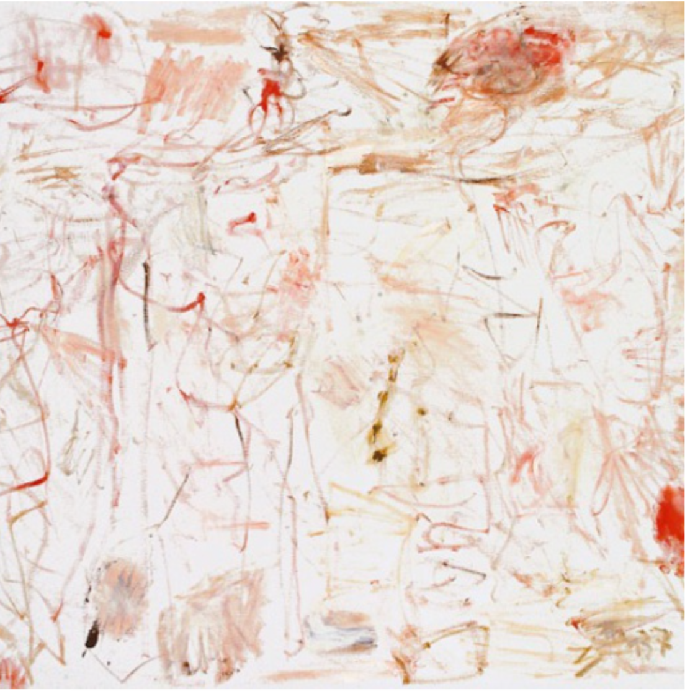
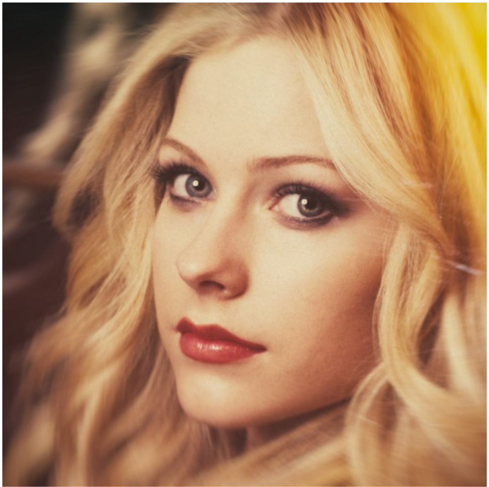
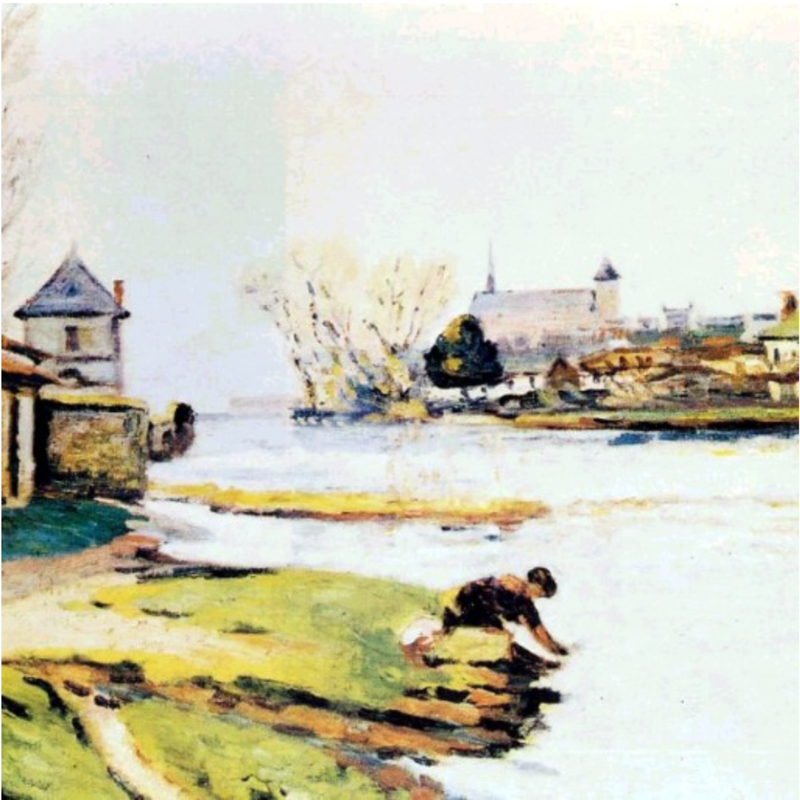
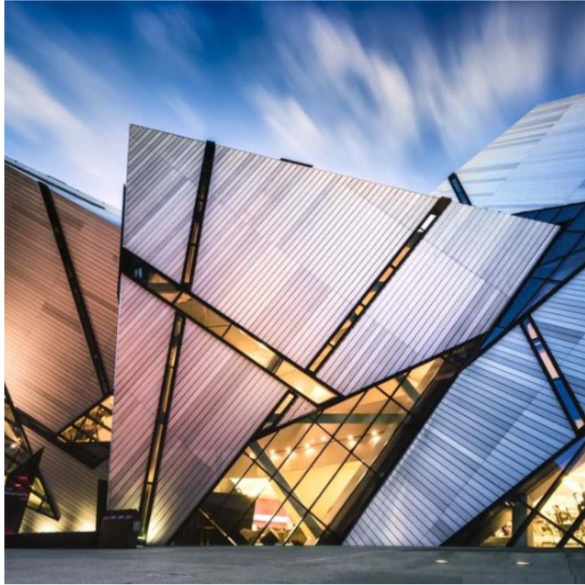
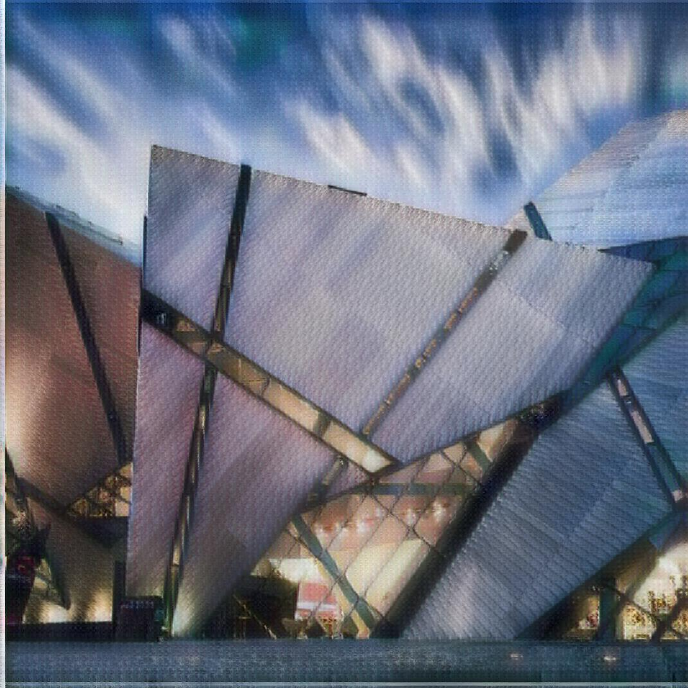
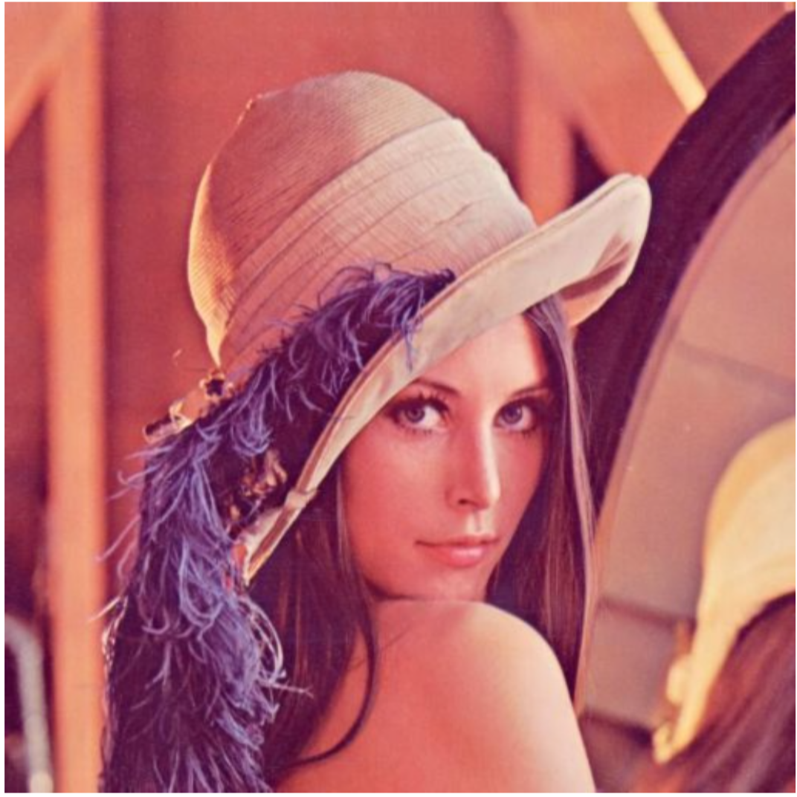
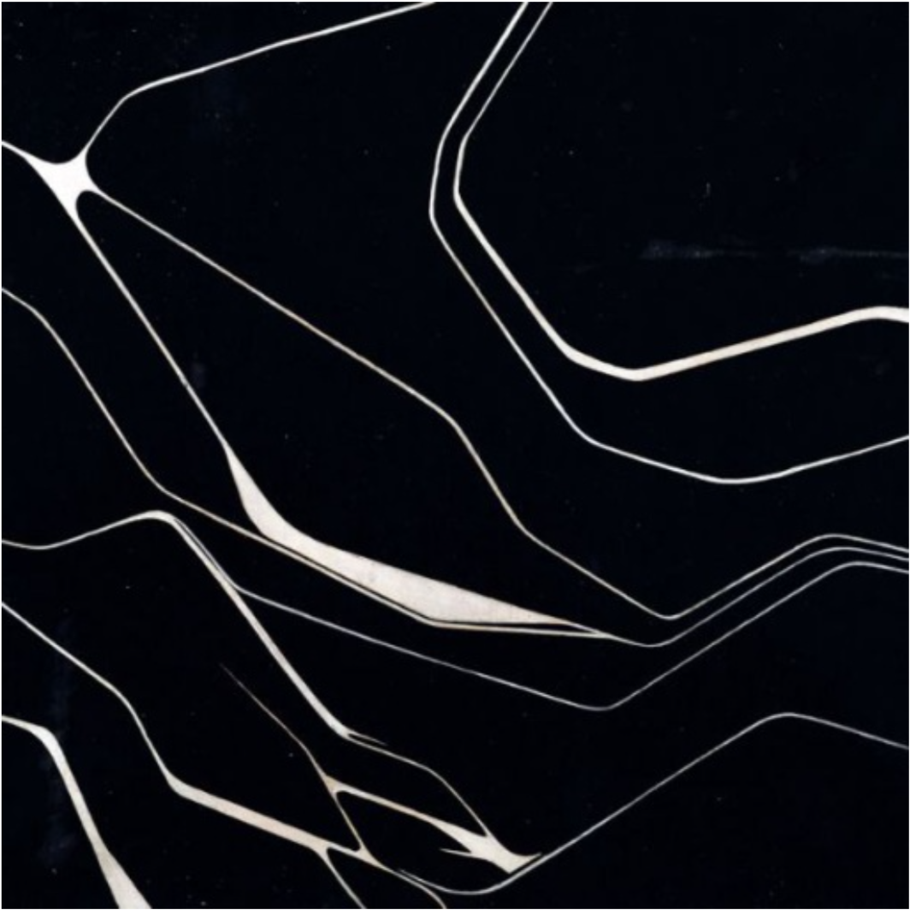

## Adaptive Style Transfer in TensorFlow and TensorLayer

### Usage

1. TensorLayer implementation of the ICCV 2017 Paper [Arbitrary Style Transfer in Real-time with Adaptive Instance Normalization](https://arxiv.org/abs/1703.06868) which supports any styles in one single model.

2. You can use the  <b>train.py</b> script to train your own model. To train the model, you need to download [MSCOCO dataset](http://cocodataset.org/#download) and [Wikiart dataset](https://www.kaggle.com/c/painter-by-numbers), and put the dataset images under the <b>'dataset/COCO\_train\_2014'</b> folder and <b>'dataset/wiki\_all\_images'</b> folder.

3. Alternatively, you can use the <b>test.py</b> script to run my pretrained models. My pretrained models can be downloaded from [here](https://github.com/tensorlayer/pretrained-models/tree/master/models/style_transfer_pretrained_models), and  should be put into the 'pretrained_models' folder for testing.

### Results

Here are some result images (Left to Right: Content , Style , Result):

   
   
   

   
   
   

   
   
   

   
   
   

   
   
   

Enjoy!

### License

- This project for academic use only.
