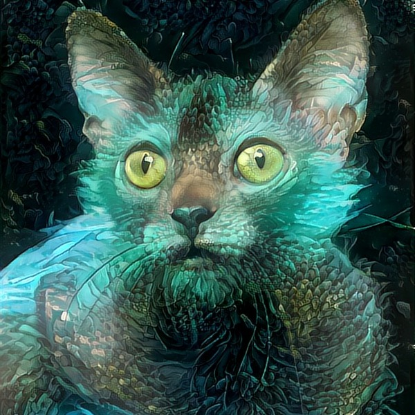

# Tensorflow Adain Style Transfer
------

1. Tensorflow implementation of the ICCV 2017 Paper [Arbitrary Style Transfer in Real-time with Adaptive Instance Normalization](https://arxiv.org/abs/1703.06868)

2. You can use the  <b>train.py</b> script to train your own model or download my model from [here](https://drive.google.com/drive/folders/1YV57U7U8Aiq2QfBEDflmO3dwuWlBMhOe?usp=sharing). The normalised VGG-19 model can also be found in this link.

3. To train the model, you need to download [MSCOCO dataset](http://cocodataset.org/#download) and [Wikiart dataset](https://www.kaggle.com/c/painter-by-numbers). Some pre-processing measures may need to be taken to delete bad images.

------

Here are some result images (Left to Right: Content , Style , Result):

   
   
   

   
   
   

   
   
   

   
   
   

------
Acknowledgments:
