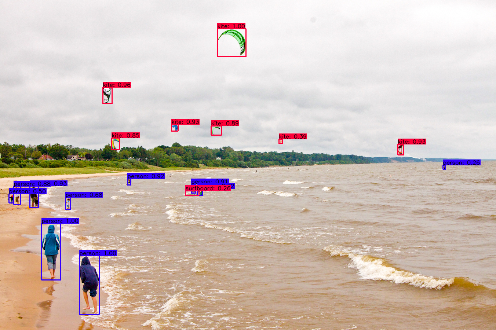
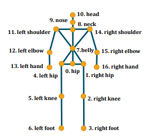
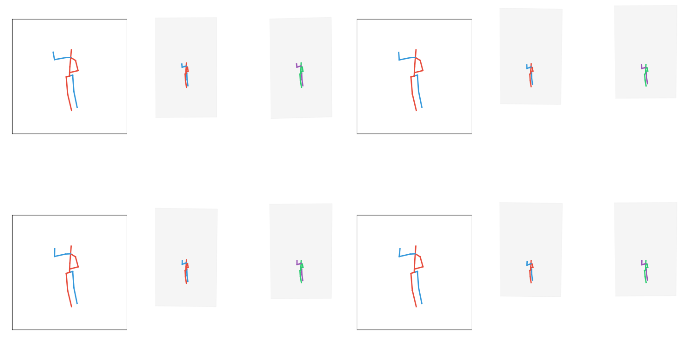

# Quick Start
TensorLayer Implementation of [YOLOv4: Optimal Speed and Accuracy of Object Detection][1]

TensorLayer Implementation of [Optimizing Network Structure for 3D Human Pose Estimation][2](ICCV2019)

## YOLOv4

Yolov4 was trained on COCO 2017 Dataset in this demo.

### Data

Download yolov4.weights file [yolov4_model.npz][3], Password: `idsz`, and put yolov4.weights under the folder `./examples/app_tutorials/model/`. Your directory structure should look like this:

```
${root}/examples
    └── app_tutorials
            └── model
                ├── yolov4_model.npz
                ├── coco.names
                └── yolov4_weights_congfig.txt

```


You can put an image or a video under the folder `./examples/app_tutorials/data/`,like:
```
${root}/examples
    └──app_tutorials
            └──data
                └── *.jpg/*.png/*.mp4/..  
```
### demo

1. Image

   Modify `image_path` in `./examples/app_tutorials/tutorial_object_detection_yolov4_image.py` according to your demand, then
   
```bash
python tutorial_object_detection_yolov4_image.py
```
2. Video
   
   Modify `video_path` in `./examples/app_tutorials/tutorial_object_detection_yolov4_video.py` according to your demand, then

```bash
python tutorial_object_detection_yolov4_video.py
```
3. Output
   
   -Image
   
   <p align="center"></p>
  
   -Video
   
   <p align="center"></p>


## 3D Human Pose Estimation

### Data

Download 3D Human Pose Estimation model weights [lcn_model.npz][4], Password:`ec07`,and put it under the folder `./examples/app_tutorials/model/`, Your directory structure should look like this:

```
${root}/examples
    └── app_tutorials
            └── model
                ├── lcn_model.npz
                └── pose_weights_config.txt
```
Download finetuned Stacked Hourglass detections and preprocessed H3.6M data([H36M.rar][5],Password:`kw9i`), then uncompress and put them under the folder `./examples/app_tutorials/data/`, like:
```
${root}/examples
    └──app_tutorials
            └──data
                ├── h36m_sh_dt_ft.pkl
                ├── h36m_test.pkl
                └── h36m_train.pkl
```
Each sample is a list with the length of 34 in three `.pkl` files. The list represents `[x,y]` of 17 human pose points:
<p align="center"></p>

If you would like to know how to prepare the H3.6M data, please have a look at the [pose_lcn][6].

### Demo

For a quick demo, simply run

```bash
python tutorial_human_3dpose_estimation_LCN.py
```
This will produce a visualization similar to this:
<p align="center"></p>

This demo maps 2D poses to 3D space. Each 3D space result list represents `[x,y,z]` of 17 human pose points.

# Acknowledgement

Yolov4 is bulit on https://github.com/AlexeyAB/darknet and https://github.com/hunglc007/tensorflow-yolov4-tflite.
3D Human Pose Estimation is bulit on https://github.com/rujiewu/pose_lcn and https://github.com/una-dinosauria/3d-pose-baseline.
We would like to thank the authors for publishing their code.


[1]:https://arxiv.org/abs/2004.10934
[2]:https://openaccess.thecvf.com/content_ICCV_2019/papers/Ci_Optimizing_Network_Structure_for_3D_Human_Pose_Estimation_ICCV_2019_paper.pdf
[3]:https://pan.baidu.com/s/1MC1dmEwpxsdgHO1MZ8fYRQ
[4]:https://pan.baidu.com/s/1HBHWsAfyAlNaavw0iyUmUQ
[5]:https://pan.baidu.com/s/1nA96AgMsvs1sFqkTs7Dfaw
[6]:https://github.com/rujiewu/pose_lcn
